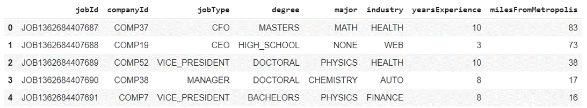
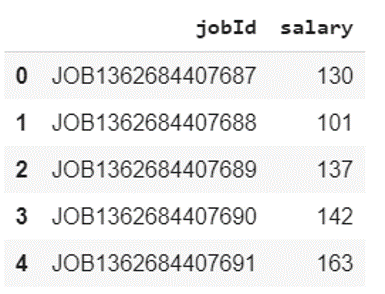
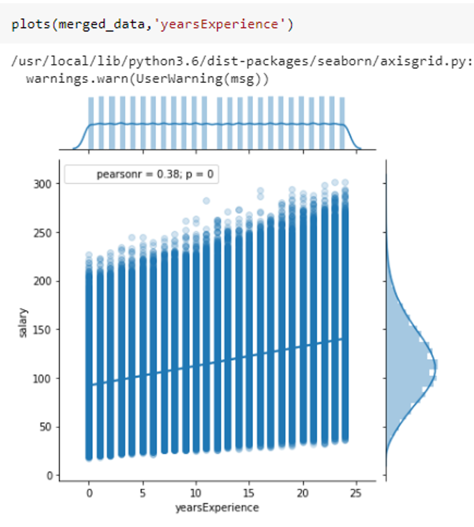
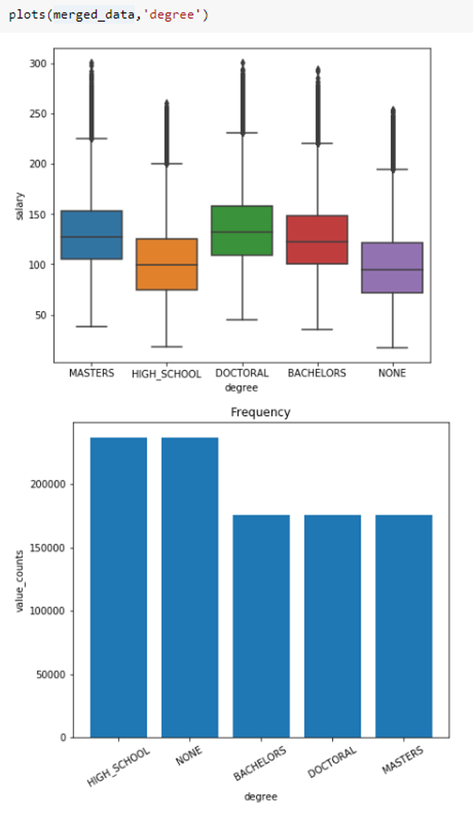
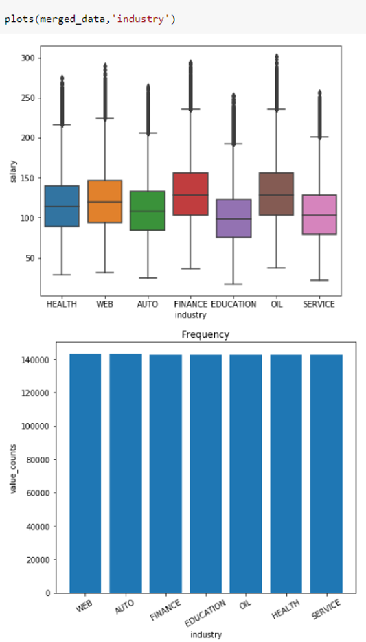
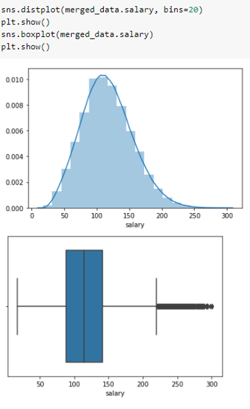
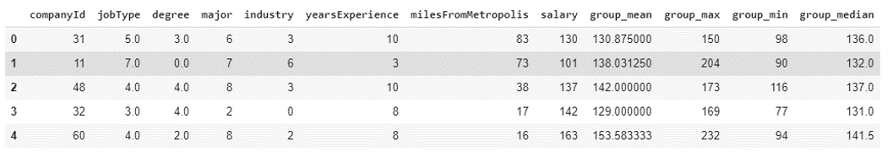
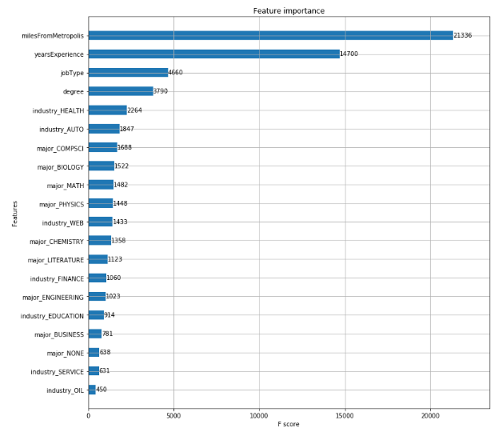

# Can ML help HR estimate the salary for the new hires, or can it help candidates know salary they should be expecting?

#

# Introduction

The goal of this project is to examine a set of job postings with salaries and predict the salary from new job posting without salary information.

These days most of the hiring is happening online with job boards publishing jobs posted by companies. So, we can make use of this publicly available data to estimate our salary if we are moving to a new role/changing industry etc.

The Intended value of this project is to provide professionals looking for jobs/Hiring with a rough estimate on salary for the position they are looking/Hiring.

# Data Collection and Preprocessing

Features Dataset has total of 1000000 rows and 8 columns. Following are the details of data,

**jobId** - jobId is the unique id for each job posting.

**companyId** - There are total of 63 unique company id, representing each company.

**jobType** - jobType column represents individual job type. Such as ECO, manager, Vice-president, CFO etc.

**degree** - degree column refers to 5 different types of degree employee has. They are doctoral, masters, bachelor, High school and None.

**major** - This represents what major they have. For example, Physics, chemistry, biology, engineering, business etc.

**industry** -industry column represents about different types of industries like Web, financial service, health, education, service, oil and auto.

**yearsExperience** - This defines how many years of experiences employee has

**milesFromMetropolis** - This indicates how far the job location from the metropolitan area.

Six of them are categorical columns and two are numerical columns.
 
 
 
Target Dataset has same no of rows and 2 columns containing primarily salary information.
 
 
 
**As part of data preparation/cleansing, I implemented the following steps:**

- I merged both datasets to train the models.
- Then I checked for missing and duplicate values in the data. There are no missing and duplicate values in the dataset.
- Removed unique id columns
- Examine potential outliers/odd values in the data
- Removed outlier data using IQR
- Removing data points that are doesn&#39;t look legitimate.
- Ordinal encoding for ordinal data
- Label encoding for nominal data

# Exploratory Data Analysis

Before building my predictive models, I did exploratory data analysis to see if I could uncover any evidence of a relationship between the features and target variables.

I&#39;ve written functions to make plotting for different variables easier:

If the predictor is a numeric type,

1. Distribution of target and predictor,
2. Scatterplot of predictor with target variable(salaries) and
3. Pearson correlation coefficient is plotted by this function.
 
 
 
If the predictor is categorical type,

1. Box plots of salaries over different levels of that categorical variable and,
2. Frequency counts over different levels are plotted.

 
 
 
The main relationships that I uncovered are,

- OIL and Finance Industries are having highest salaries
- DOCTORAL degrees are having highest salaries and surprisingly not much difference in salaries for bachelor&#39;s and master&#39;s.
- There are more people with High school degree.
- Engineering and Business majors are having highest salaries
- As expected, C-level job types are having highest salaries
- salaries of people increase with years of experience but also there is wide range for each experience level
- There are also some people with 0 experience earning very high salaries. There is 0.38 pearson correlation between salary and Years&#39; experience.
- As miles from metropolis area increases , salary decreases. But there is also a wide range for every level.

I&#39;ve checked the distribution of target salary variable,

 
 
Outliers are found and cleaned them.

# Feature Engineering

I wanted to create a function to create group statistics variables for our data to gain more signal from data.

To do this we groupby our data for all categorical variables and get salary statistics for that group as new features for training.

I merged these group statistics features with training data features.

This will help if we have more categorical variables in our dataset.

Our data looks like this after merging,

 
#
# Model Building

Before building the models, I chose a 3/4 - 1/4 train-test split for the models.

The 5 models I&#39;ve selected to build models are,

1. Linear Regression without scaling and PCA
2. Linear Regression with scaling and PCA
3. Random Forest Regressor
4. XGBoost
5. Neural network

- First, I&#39;ve created baseline models without any hyperparameter tuning.
- I&#39;ve chosen Mean squared error as an Evaluation Metric to Tune the model/choose the model
- Then I hand tuned hyperparameter for the models by changing 1 hyperparameter at a time and observed learning curves of test/train error for that parameter.
- Then I performed grid search for fine tuning the hyperparameters by using hyperparameter values in the neighborhood of hand tuned parameters.
- The fine-tuned model hyperparameters obtained from grid search/random search are then used in functions to run 4 models in a parallel way.
- Standard scalar is used to scale features for models that require scaling of features like Linear regression and Neural network.
- Pipelines and functions are created and 5 fold cross validation is run on all the models using training data (Test data is not touched during all these hyperparameter tuning and Cross validation)
- A function is created to obtain MSE results on test data.
- Average 5 fold CV MSE and Test set MSE is compared for each model.
- Best model that has lowest 5 fold CV Train MSE and Test MSE is **Neural Network**
- We are also interested in knowing about the features that are most important in determining the salary.

The results of the classification models, all of which used hyperparameter grid search, are shown below:

| **Model** | **Avg MSE (5fold CV on Train)** | **Test MSE** |
| --- | --- | --- |
| Neural Network | 309.47 | 312.09 |
| Random Forest | 320.14 | 335.36 |
| XGBoost | 332.15 | 356.11 |
| Linear regression | 356.44 | 356.11 |
| Linear regression with Scaling, PCA | 355.44 | 330.83 |

The Feature importance of the features in predicting salary is shown below,

 
#
# Conclusion
Since job position, years of experience, and location strongly influence salary, a company's finance team might want to consider these factors when allocating budget for new hires. On the other hand, if a company has fixed budget on new hires, they can decide what kind of position to hire for based on how much they have. For instance, if a company has $200k budget, then it can afford to hire a managerial position, instead of a VP.

Salary varies according to the following

- Job position: CEO > CTO & CFO > VP > Manager > Senior > Junior > Janitor
- Salary increases linearly with years of experience
- Salary decreases linearly with miles away from city
- Oil and finance industries are the highest paying, auto, health, and web are average paying, while service and education are the lowest paying.

Based on this information, candidates can also decide the type of industry, location, and position to target to achieve the desired salary. For example, if an entry-level candidate is looking to earn a lot of money, he or she should work in the city in the oil or finance industry. However, living in the city also cost more, and he or she might want to think about where to live (shorter commute to work at the expense of a higher rent vs longer commute but lower rent) depending on priorities.

**Note**

The type of company and economy are important factors to consider when predicting salary but they are not included in the model. A start-up will pay less than a bigger company and salary will be lower during times of economic downturn. While it is important to consider the type of position and industry, we should also keep in mind other variables that are not included in the model.

Please check the notebook for details: https://github.com/kbpavan/SalaryPredictions/blob/master/Project__.ipynb
